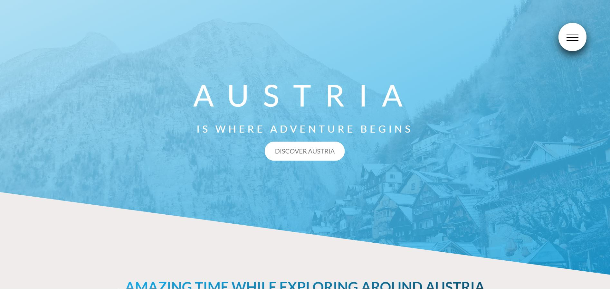
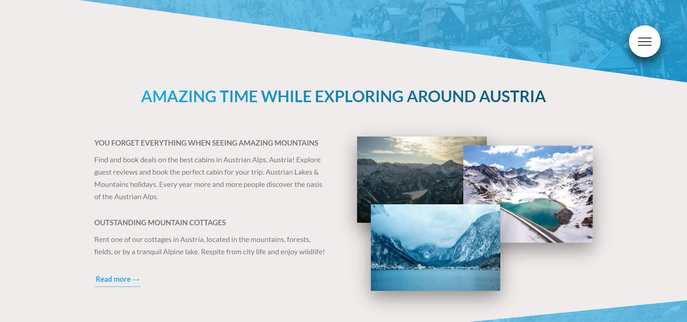
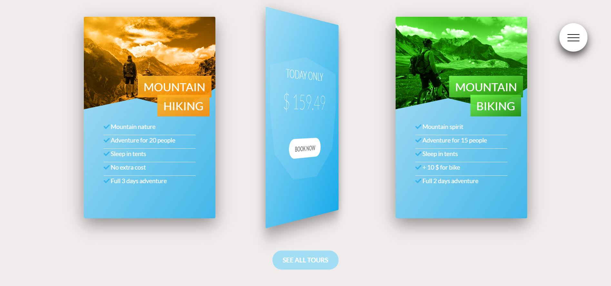
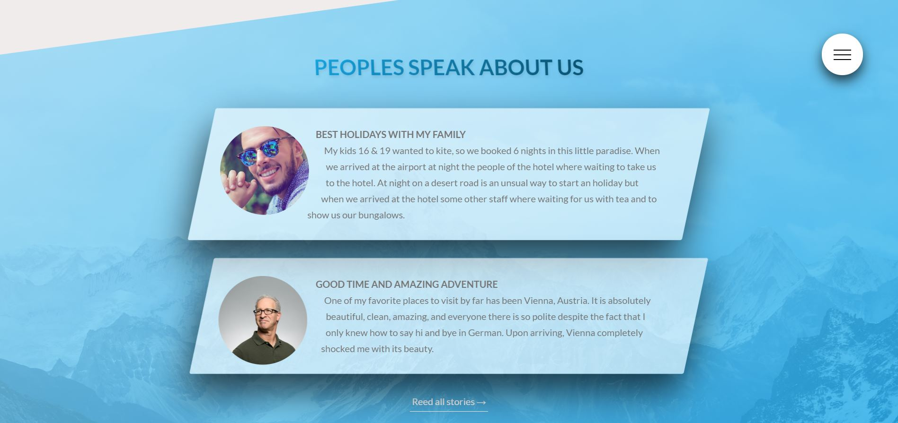
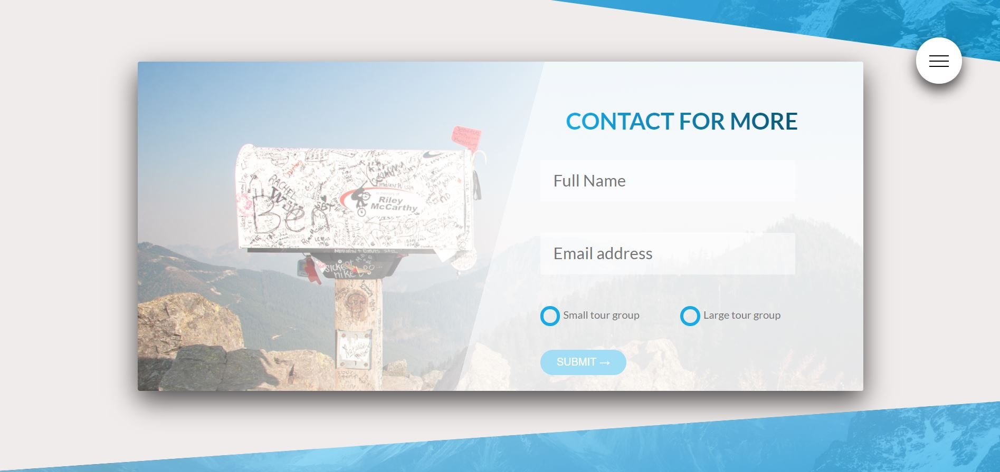
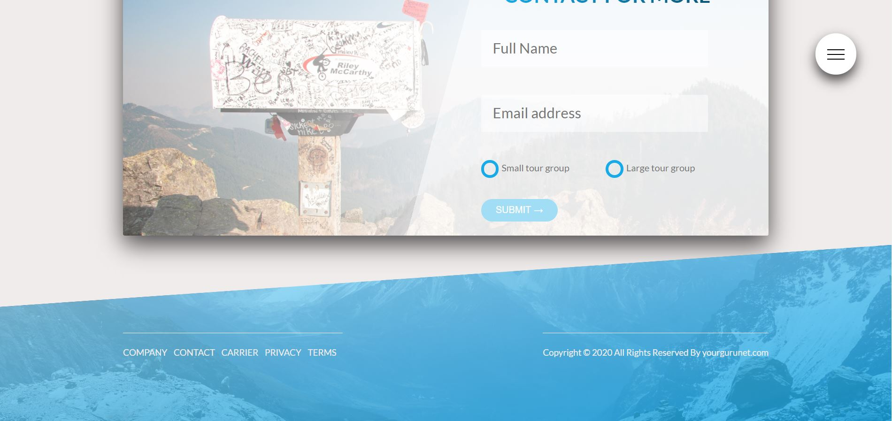

<h1>
Explore Austria simple represantative web page.</h1>

 Fully functional front-end made as a representative website for tours in Austria. Made using SASS components and simple HTML. Used advanced CSS styles to make pages maximal representative and dynamic using just CSS. In the building process, there is no use of JavaScript for any animations or functions. All effects and popups are made with CSS hacks and tricks. Web pages are hosted using GitHub. Also used the Git source control that allows you to record changes to files over time and allows you to view changes and specific versions of those files later on.

<h5>Check demo:  <a href="https://yourgurunet.github.io/SASS-CSS-EXPLORE-AUSTRIA-WEB/" target="_blank">Demo</a>  </h5>
 

